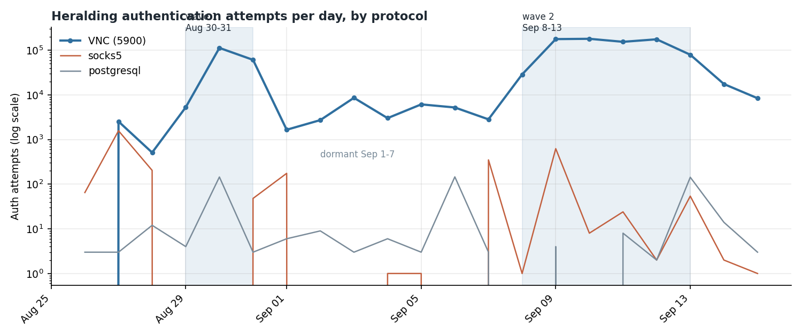
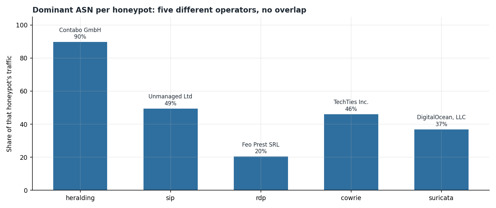
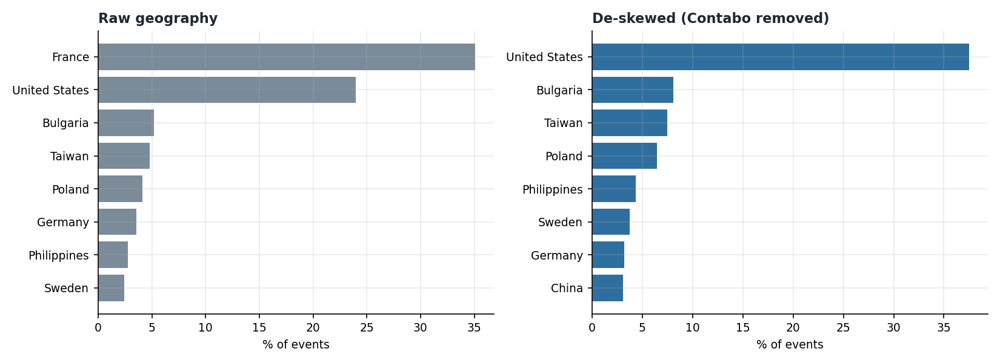
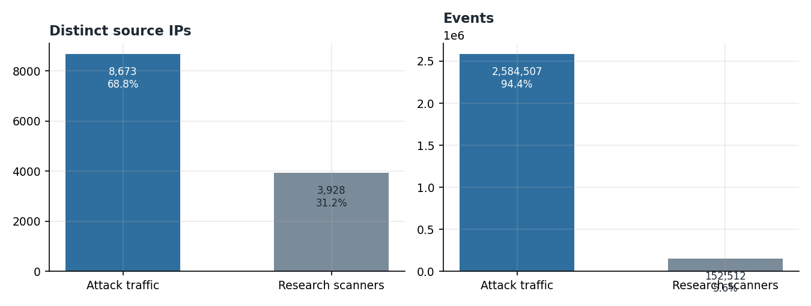
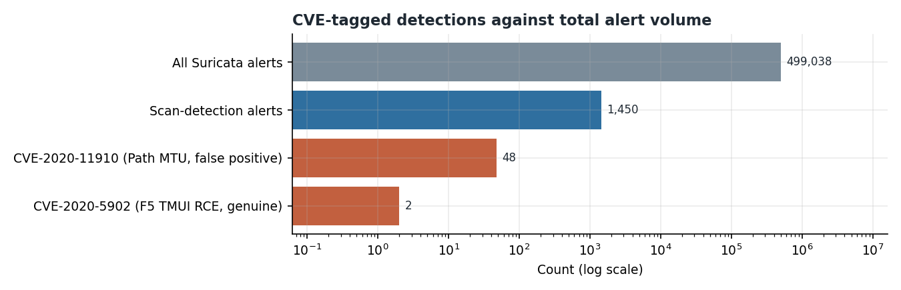

# Honeypot Threat Intelligence Report

A 21-day threat intelligence collection using a 39-container T-Pot honeypot deployed on an internet-exposed cloud VPS, followed by independent analysis of the raw logs.

This is not a lab capture against simulated traffic. The host was fully exposed to the public internet on TCP and UDP ports 1 to 64000 for the entire window, and every event in this dataset came from a real unsolicited connection. First contact arrived 4 minutes after exposure.

The analysis in this repository was rebuilt from raw honeypot logs, not from the dashboard. That distinction produced six corrections to my own collection notes, and those corrections are documented rather than quietly fixed.

---

## Results

| Measure | Result |
|---|---|
| Collection window | 21 days, Aug 25 to Sep 15, 2026 |
| Time to first contact | 4 minutes |
| Documents indexed | 38,017,308 |
| Honeypot attack events | ~4,000,000 |
| Unique source IPs | 43,095 |
| Honeypot containers deployed | 39 |
| Honeypots analyzed from raw logs | 5 |
| Events independently parsed | 2,982,277 |
| IPs resolved to ASN and country | 12,563 of 12,601 (99.7%) |
| Malware samples captured (SHA-256) | 7 |
| Genuine CVE-specific detections | 1 in ~4,000,000 attacks |
| Unplanned outage | ~2 minutes total |
| Data loss | None |
| Total cost | $54.53 |

## Central finding

**Attackers overwhelmingly guess credentials. They almost never exploit vulnerabilities.**

Across 21 days and roughly four million attack events, Suricata produced exactly one genuine CVE-specific detection: two probes for the F5 BIG-IP TMUI remote code execution flaw, CVE-2020-5902, both from the same address. The only other CVE-tagged signature fired 48 times and turned out to be a false positive on ordinary Path MTU Discovery traffic.

Everything else was credential brute force and port scanning. Ten honeypots recorded meaningful volume and every one of them was targeted the same way: try the default password, try the vendor backdoor account, try a wordlist, move on.

The second finding is about attribution. What looked during collection like three sequential attack phases turned out, once the traffic was resolved to its hosting infrastructure, to be five concurrent campaigns run by different operators from five different providers with no overlap in dominant ASN. The appearance of a progression was an artifact of their activity peaks overlapping.

---

## Contents

### Report

| File | Description |
|---|---|
| [`report/Honeypot-Threat-Intelligence-Report.pdf`](report/Honeypot-Threat-Intelligence-Report.pdf) | Full analysis report |

### Data

Every CSV is generated by the scripts in this repository from raw honeypot logs. Nothing was exported from Kibana.

| File | Description |
|---|---|
| [`data/asn_full_window.csv`](data/asn_full_window.csv) | Every ASN observed, with event counts, IP counts, and share of total |
| [`data/asn_by_honeypot.csv`](data/asn_by_honeypot.csv) | ASN breakdown per honeypot, the evidence for the concurrent-campaign finding |
| [`data/country_full_window.csv`](data/country_full_window.csv) | Raw geographic distribution |
| [`data/country_deskewed.csv`](data/country_deskewed.csv) | Same, with the single dominant ASN removed |
| [`data/scanner_vs_attack.csv`](data/scanner_vs_attack.csv) | Research scanning separated from attack traffic |
| [`data/ip_enrichment.csv`](data/ip_enrichment.csv) | All 12,601 source IPs with ASN, organization, and country |
| [`data/cowrie_commands.csv`](data/cowrie_commands.csv) | 8,569 commands typed into SSH sessions |
| [`data/cowrie_downloads.csv`](data/cowrie_downloads.csv) | Malware fetch attempts with URLs and SHA-256 hashes |
| [`data/malware_attribution.csv`](data/malware_attribution.csv) | VirusTotal results per sample: detections, architecture, family labels |
| [`data/cowrie_credentials.csv`](data/cowrie_credentials.csv) | Every SSH and Telnet login attempt, plaintext, with success flag |
| [`data/cowrie_client_versions.csv`](data/cowrie_client_versions.csv) | SSH client banner fingerprints |
| [`data/heralding_daily_by_protocol.csv`](data/heralding_daily_by_protocol.csv) | Daily VNC series showing the two-wave campaign |
| [`data/sip_called_numbers.csv`](data/sip_called_numbers.csv) | 128,666 numbers dialed through the SIP honeypot |
| [`data/sip_user_agents.csv`](data/sip_user_agents.csv) | Spoofed PBX identity strings |
| [`data/rdp_usernames.csv`](data/rdp_usernames.csv) | RDP usernames, including the malformed strings discussed in the report |
| [`data/suricata_signatures.csv`](data/suricata_signatures.csv) | All 100 IDS signatures with counts |
| [`data/suricata_cve_alerts.csv`](data/suricata_cve_alerts.csv) | The 50 CVE-tagged alerts in full |

Twenty-two additional CSVs are in [`data/`](data/).

### Scripts

| File | Description |
|---|---|
| [`scripts/parse_rdp.py`](scripts/parse_rdp.py) | RDP honeypot parser, handles log rotation and deduplication |
| [`scripts/parse_b1.py`](scripts/parse_b1.py) | Cowrie and Heralding parser |
| [`scripts/parse_b2.py`](scripts/parse_b2.py) | Sentrypeer and Suricata parser |
| [`scripts/enrich_ips.py`](scripts/enrich_ips.py) | ASN and country join against MaxMind GeoLite2 |
| [`scripts/sanitize_repo.py`](scripts/sanitize_repo.py) | Sanitization and verification pass used before publication |
| [`scripts/sanitize_screenshots.py`](scripts/sanitize_screenshots.py) | Crops browser chrome and desktop furniture from the screenshots |
| [`scripts/charts_*.py`](scripts/) | Chart generation, one per data source |

### Charts

Fifteen charts in [`charts/`](charts/), all generated from the CSVs above.

### Screenshots

Twenty-three Kibana captures from the collection window, plus the two NVD verification
pages, in [`screenshots/`](screenshots/) with [an index](screenshots/README.md) describing
each one. Browser chrome was cropped from every capture because the honeypot address was
visible in the URL bar.

These are a record of the live deployment, not evidence for the analysis. Every chart above
is regenerated from raw logs. Where a capture disagrees with the report, the report is
correct.

---

## Selected findings

### The VNC campaign runs on a schedule

A single operator renting infrastructure from one German hosting provider generated 966,740 events, 35.32% of everything collected, from 82 addresses. The campaign ran in two waves separated by a week of near-silence.

Wave one peaked August 30 at 112,776 authentication attempts in a day. Activity then fell to roughly 3% of peak for a week. Wave two began September 8, peaked September 10 at 180,357, and was still declining when the honeypot was torn down.

I concluded on September 5 that the campaign had ended. It had not. Running the full 21 days instead of tearing down early is the only reason the dormancy cycle is visible at all.

### Five honeypots, five different operators

No hosting provider dominates more than one protocol. VNC traffic is 90% one provider, SIP is 49% a different one, SSH is 46% a third, RDP is 20% a fourth, and general scanning is 37% a fifth.

This is what corrected the sequential-phase reading. The campaigns are independent and concurrent, not one adversary changing targets.

### Geography measures where servers are rented

France is 35% of all traffic and the single largest source country. Every French event traces to one hosting provider's datacenter. Remove that one ASN and France effectively disappears from the results.

"France was the top attacking country" is true and tells you nothing. Both views are published so the difference is visible.

### Research scanning is most of the noise and almost none of the volume

Nearly a third of the addresses that touched the honeypot were measurement infrastructure, and they accounted for under 6% of events. Scanners are built for coverage and touch every host once. Attackers are built for depth and hammer a few.

Any honeypot statistic counted by unique IPs describes a mostly different population than one counted by event volume.

### Vulnerability exploitation is rare

One genuine CVE-specific detection across the entire window. The report covers both CVE-tagged signatures, including why the more frequent one is a false positive and why NVD and CISA disagree on its severity by four points.

---

## Method

Collection and analysis were separate efforts, and the second did not trust the first.

1. Build and hardening, with egress filtering applied before exposure
2. 21-day collection with seven scheduled health checkpoints and four verified data exports
3. Teardown and infrastructure destruction
4. Independent parse of raw logs for five honeypots
5. ASN and country enrichment rebuilt from scratch after the Elasticsearch cluster was destroyed
6. Cross-checking every collection-time conclusion against the parsed data
7. Report

Step 6 is why this repository exists in its current form. Every figure in the report traces to a CSV in `data/`, and every CSV traces to a script in `scripts/` that can be rerun against the raw logs.

## Decisions worth surfacing

**Egress filtering was applied before the host went live, not after.** Outbound SSH, SMTP, and arbitrary ports were blocked so the honeypot could not be used to attack third parties. Inbound exposure almost never causes a provider suspension. Outbound abuse does.

**The hosting provider was notified before exposure, not after an incident.** A disclosure ticket describing the deployment was opened prior to go-live. When an external scanning organization reported an exposed Elasticsearch instance three days in, there was already a ticket to reference.

**The deployment ran on 8 GB rather than the documented 16 GB.** Compensating controls were applied and documented: 4 GB swap with reduced swappiness, log persistence cut from 30 cycles to 14, and index lifecycle retention reduced from 30 days to 21. The cluster reported green at all seven checkpoints and no kernel out-of-memory kills occurred.

**Early teardown was considered twice and rejected both times.** Tearing down on September 7 would have cost about $16 less and would have produced a report concluding that the VNC campaign ended on September 5. It did not.

**Six errors in my own collection notes are documented rather than silently corrected.** Every one came from reading Kibana dashboard panels, which aggregate across all honeypots and render timestamps in browser local time. They are listed in the report with what was wrong and what the raw data shows.

---

## Limitations

Stated in full in the report and material to interpreting the results:

- **Low-interaction honeypots.** No connecting party received a real shell on real hardware. This was a deliberate safety decision and it bounds what the dataset can show.
- **No human intrusion observed.** Across 1,397 successful logins and 1,182 sessions with typed commands, no session was distinguishable from automation. Partly a property of the instrument.
- **Egress filtering shaped malware capture.** HTTP and HTTPS were permitted, so payload retrieval over port 80 succeeded. Fetches over other ports did not.
- **Malware binaries were not retained.** Only the log directory was exported at teardown. Hashes survive; the samples do not. Family attribution comes from VirusTotal multi-engine analysis of the hashes, not from local static analysis, and none is claimed.
- **The SMTP honeypot was disabled,** so no conclusions about mail-vector attacks can be drawn from this dataset.
- **Enrichment is point-in-time.** ASN and country were resolved four days after teardown. Assignments change.
- **Single host, single region, single 21-day window.** A honeypot in a different address block would likely see a different mix.

## Sanitization

This is the published version. My own administrative IP address has been removed from all data files, and the decommissioned honeypot IP is redacted to `HONEYPOT_IP`. Captured NTLMv2 and VNC challenge-response material is excluded, as is the honeypot's TLS key material. Hosting provider ticket numbers are omitted.

Attacker source addresses, credentials, dialed numbers, malware URLs, and sample hashes are published. That is standard practice in honeypot research and all of it is already present in public threat feeds.

No finding, count, or conclusion has been altered.

---

## References

- Deutsche Telekom Security, *T-Pot: The All In One Multi Honeypot Platform*
- MITRE, *ATT&CK for Enterprise*, v15
- NIST, *National Vulnerability Database*, CVE-2020-5902 and CVE-2020-11910
- MaxMind, *GeoLite2 ASN and Country databases*, September 2026
- Proofpoint, *Emerging Threats ruleset*

---

**Mohsin Adan** · CompTIA Security+ (SY0-701) · B.A.S. Cybersecurity, George Mason University
